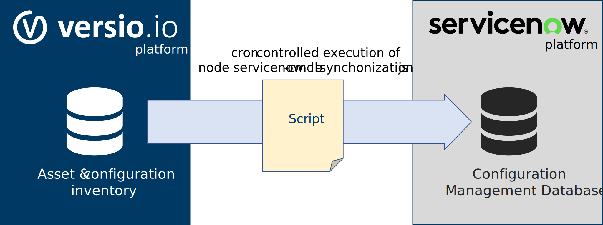

# Synchronization Versio.io to ServiceNow CMDB 

This script helps ServiceNow users to transfer the high-quality instances of Versio.io Assets & Configuration Inventory into ServiceNow CMDB.



## Requirements

- Node.js version 14 or above
- 'axios' Node.js package
- Linux cron to run synchronization at a custom specific date and time 

## How to use it

After cloning the repo, open the folder in the terminal and execute the command `npm i` to install the required package.  
Now you can start the script through the command `node servicenow-cmdb-synchronization.js`.  
If the script is not working because of some missing parameters, take a look to the next section.

## Parameters

To correctly execute the script, you have to set some parameters into the script file.  
Open the file `servicenow-cmdb-synchronization.js` with your favorite text editor and set them.

- **SERVICE_NOW_URL**
  - URL of your own ServiceNow instance (eg. `"https://dev000000.service-now.com"`).
- **SERVICE_NOW_USERNAME**
  - The username to access your own ServiceNow instance.
- **SERVICE_NOW_PASSWORD**
  - The password to access your own ServiceNow instance.
- **SERVICE_NOW_TABLE**
  - The name of the table where you want to import the data (eg. `"cmdb_ci_server"` for Servers table and `"cmdb_ci_service"` for Services). You can find the right table name using the REST API Explorer (look for "Table API" in the "now" namespace) in your ServiceNow instance.
- **VERSIO_URL**
  - URL of your Versio.io instance. The default one is `"https://live.versio.io"` and you should change it only if you have an on-premise Versio.io instance.
- **VERSIO_ENVIRONMENT**
  - The 10-charachters ID of your Versio.io environment. You can find it in the first line of the Dashboard tab between the brackets.
- **VERSIO_APITOKEN**
  - To export your data from Versio.io you need to create an API token. Go to Environment settings -> Access management -> API tokens and create a new token with "CMDB viewer" rights.
- **VERSIO_ENTITY**
  - The name of the instances group you want to export to ServiceNow (eg. `"host"` for Hosts and `"service"` for Services). You can find the right entity name using the "Instances viewer" tab and selecting the single group of entity you want to export. The string after `"ens="` in the page's URL is the attribute you need.
- **MAPPING**
  - Use `"linux-host"`, `"windows-host"` or `"service"` for the default mapping, otherwise you can define your own mapping in this parameter or you can extend the switch in the setMapping function at line 29.

## Mapping

To define your specific mapping, you need to create an object which contains entries with the ServiceNow attribute name as key and an array containing the attribute's path in the versio.io object as value.

#### Example
We want to import `name`, `serial_number`, `os` and `os_version` into ServiceNow CMDB from the following Versio.io object:  

```json
{
    "displayName": "desktop",
    "system": {
        "serialNumber": "SN00452"
    },
    "chassis": {
        "type": "Notebook",
        "version": "Not Available"
    },
    "32-bitMemoryError": {
        "type": "OK"
    },
    "technology": {
        "Operating system": {
            "vendor": "Canonical",
            "product": "Ubuntu",
            "version": "20.4"
        }
    }
}
```

To achieve the result, we need to define a mapping object like this:  
```json
{
    "name": ["displayName"],
    "serial_number": ["system", "serialNumber"],
    "os": ["technology", "Operating system", "product"],
    "os_version": ["technology", "Operating system", "version"],
}
```
